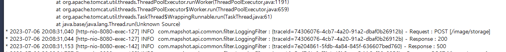

# 23.02 / 모놀리식으로 이사가는 날

<figure><figcaption>
회귀하는 연어
</figcaption></figure>

&#x20;문득 이런 생각을 해 본다. 기술이 필요에 의해 발전했다면, 항상 최신 기술을 쓴다면 모든 문제가 해결 되는 것일까?

&#x20;나는 이 문장에서 방점을 찍을 곳은 '기술'이 아니라 '필요' 라고 생각한다.\
기술은 누군가의 불편함과 필요에 의해 발전하지만, 그 사람이 겪었던 문제와 나의 상황이 일치한다는 보장은 없기 때문이다. 변명처럼 자꾸 서론을 늘어놓는 이유는, 현재 내 상황이 최신 기술 트렌드와는 다르게 보일 수 있기 때문이다.&#x20;

&#x20;마이크로 서비스가 어느 순간부터 절대적인 진리처럼 여겨지는 것 같았다. 물론 난 해당 기술에 대한\
이해도 역시 낮고, 겨우 신입인 내가 함부로 판단할 수 있는 문제는 아니지만, 나의 현재 상황은 아무리 생각해도 API 서버를 나눌 근거가 없었다.

&#x20;그래서 난 모놀리식 서버로 회귀한다. 그 근거는 다음과 같다.

1. **처음 구상했던 설계와 달라졌다.**

먼저 현재 상황을 간략히 요약하자면,&#x20;

* 공지사항 API&#x20;
* 이미지 제작 요청 API

다음과 같은 2개의 API가 각각 작동 중이다.\
처음에 이 둘을 나눠서 제작했던 까닭은, 이미지 API가 AWS Lambda에게 **'제작 요청'** 을 하는 것이 아닌, 직접 **'제작'** 을 하는 서버였기 때문이다. 크롤링 관련 작업을 도맡아서 하는 API 였고, 서버 자원을 있는대로 다 끌어다 사용했기 때문에 이미지 제작 시 다른 기능에도 영향을 끼쳤고, 이를 방지하기 위해 별도의 인스턴스로 분리 후 도커를 이용해 자원 사용량을 제한하려 했다.

그런데 AWS Lambda를 사용하며 상황이 달라졌다. 무거운 작업은 람다에서 모두 처리되고, 이제 이미지 API 서버도 단순 입출력 역할만 하기 때문에 크게 부하가 걸리는 일은 사라지게 되었다.\
처음 의도와 달라졌고, 존재의 이유는 빈약해졌다.

2. **유저들이 공지사항을 잘 안 본다**

이 말을 더 포장하자면, 뭔 일 터지기 전까지는 거의 안 본다.\
당연한 이치인 것 같다. 아무래도 업무 보조 사이트의 특성이기도 하고, 메인 페이지에서 관련 작업이 끝나면 나가는 유저가 대부분이다. \
굳이 공지사항 API가 별도로 존재해야 할 정도의 이유도, 중요성도 없다.

3. **서버 리소스가 부족하다**

현재 AWS의 t2.micro 서버를 사용 중인데, 메모리 1GB에 이것 저것 띄우려면 참으로 힘들다.\
모니터링 툴로 와탭 이라는 서비스를 이용 중인데, 전체 메모리 사용량이 항상 90% 에서 간당간당 하는 모습을 보면 내가 숨이 막힐 지경이다.\
하루에 1,2명 볼까 말까 한 서비스와 100명씩 꾸준히 사용하는 서비스의 자원 할당량이 동등하다면 이는 리소스 낭비가 아닐까?

&#x20;다음과 같은 이유 때문에 나는 다시 돌아간다.\
모든 일에는 이유가 있고 각자의 사정이 있다. \
누군가는 강물을 거슬러 올라가는 연어를 보며 역행 한다고 생각할 수 있지만, \
연어의 입장에서는 자신의 목적을 위한 순행의 과정이 아닐까 하는 생각도 든다.
