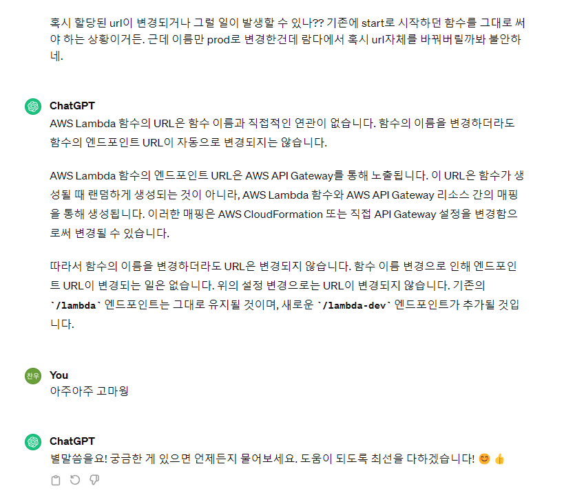

---
layout:
  title:
    visible: true
  description:
    visible: false
  tableOfContents:
    visible: true
  outline:
    visible: true
  pagination:
    visible: true
---

# 23.06 / DB 서버 장애

<figure><figcaption>
당시 슬랙
</figcaption></figure>

## 이건 또 뭔 에러냐

6월의 어느 날, 슬랙이 요란하게 울렸다.\
근데 난생 처음 보는 타입의 에러였다. 'Cannot Create Transaction 이라면 DB 쪽 에러인가??' 싶어서 서비스의 유일한 DB 공지사항 페이지를 들어가 보았다. 접속과 동시에 슬랙이 다시 전송되었다. DB 관련 에러가 확실해졌다.

## 불확실 덩어리

문제는 언제 터진 것인지, 원인이 무엇인지파악조차 힘들었다.&#x20;

유저들이 공지사항은 거의 안 봐서 슬랙 알람이 온 시점에 DB 서버가 장애가 났다고 장담할 수도 없었고,\
복구를 위한 원인 파악도 매우 힘들었다. 먼저 인프라 구성에 대해 간략한 설명 후, 힘들었던 점과 재발 방지를 위해 행동한 점들을 사건의 시간 순서대로 기술해 보려고 한다.
